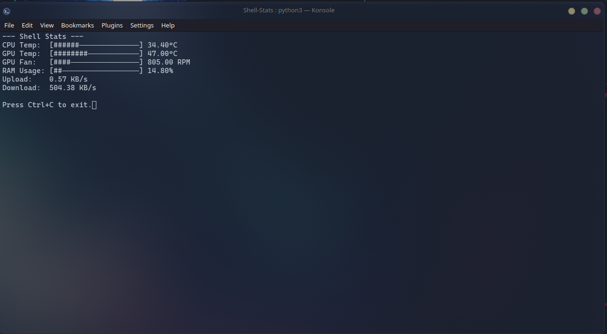

# Shell-Stats
A Simple script to run in terminal to monitor basic hardware metrics
<BR><BR>

<BR><BR>
Required:
<BR><BR>
Python 3 <BR>
Python pip <BR>
psutil package:
<BR>

```python
pip install psutil
```
<BR>
lm-sensors:
<BR>

```bash
sudo apt-get install lm-sensors
```
<BR><BR>
Once all is installed, open your folder where the script is in terminal and run:

```bash
python3 shell_stats.py
```
<BR>
- JayFeezie
